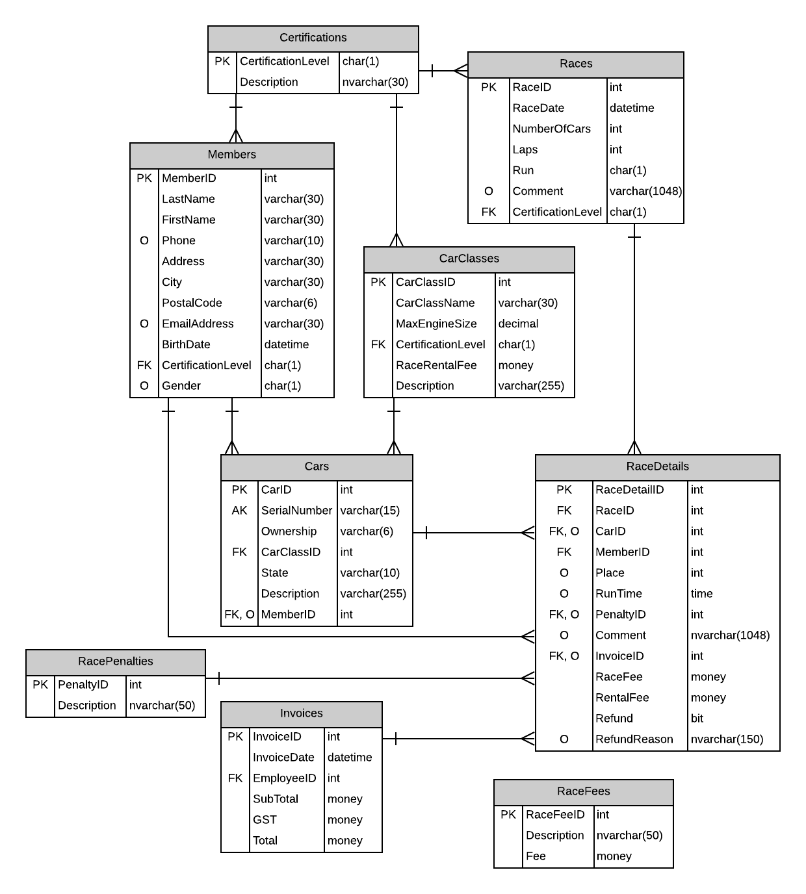

# Racing Subsystem

## ERD

### Original ERD



### Registration ERD


### Results ERD


## UI

### Registration UI


### Results UI


### UI Controls Scheme


## View Models

```c#

public class ScheduleViewModel
{
    // ID
    public int RaceID { get; set; }

    // Display
    public Datetime Time { get; set; }
    public string Competition { get; set; }
    public char Run { get; set; }
    public int Drivers { get; set; }
}

public class RosterViewModel
{
    // ID
    public int RaceDetailID { get; set; }

    // Display
    public string Name { get; set; }
    public decimal RaceFee { get; set; }
    public decimal RentalFee { get; set; }
    public int Placement { get; set; }
    public bool Refunded { get; set; }

    // Edit
    public string CarClass { get; set; }
    public string SerialNumber { get; set; }
    public string Comment { get; set; }
    public string Reason { get; set; }
}

public class ResultsViewModel
{
    // ID
    public int RaceDetailID { get; set; }

    // Display
    public string Name { get; set; }
    public TimeSpan Time { get; set; }
    public string Pentalty { get; set; }
    public string Placement { get; set; }
}
```

## Implementation Plan

### Registration UI Events

* `Page_Load()` - Display Calander via <asp:Calander />.

* `Calander_OnSelectionChanged()` - Auto-Postback
  * Trigger `<asp:ObjectDataSource>` to populate an `<asp:ListView>` control with data from `List<ScheduleViewModel> GetScheduleByDate(DateTime date)`.

* `Schedule_OnItemCommand()` - Auto-Postback
  * Trigger `<asp:ObjectDataSource>` to populate an `<asp:ListView>` control with `RaceDetailID` from `List<ScheduleViewModel> GetRosterById(int RaceId)` method.
  * Populate multiple `<asp:DropDownList>` controls:
    * Drivers will be populated by `GetDriversByRosterId(int RaceDetailsId)`.
    * RaceFee will be populated by `GetRaceFees()`.
    * CarClass will be populated by `GetCarClasses(int RaceDetailsId)`.
    * SerialNumber will be initialized.

* `CarClass_OnItemSelected()` - Auto-PostBack
  * Trigger `<asp:ObjectDataSource>` to populate the `<asp:DropDownList>` for SerialNumber using `GetSerialNumbers(int CarClassId)`.

* `Roster_OnItemCommand()` - The ListView will handle calls based off of Command Names:
  * Edit - Display `EditItemTemplate` as normal.
    * Trigger `<asp:ObjectDataSource>` to populate the `<asp:DropDownList>` for CarClass and SerialNumber.
  * Save - Call UpdateRoster(int raceDetailID, RosterViewModel roster).
  * Cancel - Cancel `EditItemTemplate` as normal.

* `RecordTimes_OnCommand()`
  * Redirect to Results page with query including `RaceId`.

### Registration BLL Methods

```c#
// Lists
//// Calendar
public List<ScheduleViewModel> GetScheduleByDate(DateTime date) {...}
//// Schedule
public List<RosterViewModel> GetRosterById(int raceId) {...}
//// Roster
public List<DriverItem> GetDriversByRosterId(int RaceDetailsId) {...}
public List<FeeItem> GetRaceFees() {...}
public List<ClassItem> GetCarClasses(int RaceDetailsId) {...}
public List<CarItem> GetSerialNumbers(int CarClassId) {...}

public void RecordTimes(int RaceDetailsId) {...}

// Commands
public void AddRoster(RosterViewModel roster) {...}
public void UpdateRoster(int raceDetailID, RosterViewModel roster){...}

// ViewModels - Key/Value Pairs.
public class DriverItem {...}
public class FeeItem {...}
public class ClassItem {...}
public class CarItem {...}
```

### Results UI Events

* `Page_Load()` - Populate a `<asp:ListView>` control and some `<asp:DropDownList>` controls via `<asp:ObjectDataSource>` controls.
  * Check that page was passed value that can be parsed to an `int` for `RaceId`.
  * ListView will be poplulated by `List<ResultsViewModel> GetResultsById(int raceId)`.
  * DropDowns will be populated by `List<PentaltyItem> ListPentalties()`.

* `SaveTimes_OnCommand()`
  * Calculate place based upon `Time` values.
  * Call `SaveResults(List<ResultsViewModel> results)` to begin transactions of results.

### Results BLL Methods

```c#
// Lists
public List<ResultsViewModel> GetResultsById(int raceId) {...}
public List<PentaltyItem> ListPentalties() {...}

// Commands
public void SaveResults(List<ResultsViewModel> results) {...}

// ViewModel - Key/Value Pair
public class PenaltyItem {...}
```
